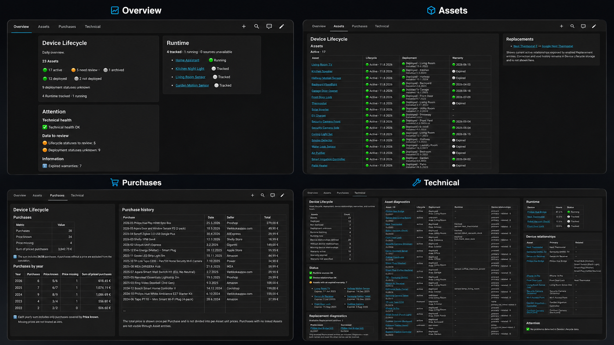

<p align="center">
  
</p>

<h1 align="center">Device Lifecycle</h1>

<p align="center">A Home Assistant custom integration for tracking the identity, acquisition, deployment, lifecycle, replacement history, warranty, relationships, and runtime of physical Assets.</p>

<p align="center">
  <a href="https://my.home-assistant.io/redirect/hacs_repository/?owner=ristotoivanen&amp;repository=home-assistant-device-lifecycle&amp;category=integration"></a>
  <a href="https://github.com/ristotoivanen/home-assistant-device-lifecycle/releases"></a>
  <a href="LICENSE"></a>
</p>

<p align="center">
  <a href="#whats-new-in-074">What's new</a> ·
  <a href="#installation">Installation</a> ·
  <a href="#quick-add">Quick Add</a> ·
  <a href="#optional-dashboard">Dashboard</a> ·
  <a href="#what-device-lifecycle-is">Asset concepts</a> ·
  <a href="#lifecycle-status">Lifecycle</a> ·
  <a href="#runtime-tracking">Runtime</a> ·
  <a href="#documentation">Documentation</a> ·
  <a href="#support">Support</a>
</p>

## What Device Lifecycle is

Device Lifecycle keeps one stable canonical record for each real-world physical item while treating Purchases and Home Assistant devices as relationships rather than identity. Its UI is available in English and Finnish. The product name is **Device Lifecycle** in both languages, and the Finnish name of the human-readable Asset ID is **Elinkaaritunnus**.

An **Asset** is the canonical record of one real-world physical item. A Purchase records how an Asset was acquired, while a Home Assistant device is an optional relationship to that Asset. Neither one defines Asset identity.

Every Asset has two permanent identifiers:

- an immutable internal UUID used for technical relationships and stable entity unique IDs
- a human-readable Asset ID such as `DL0014`

Asset IDs are allocated monotonically and never recycled. The UUID and Asset ID remain unchanged when the Purchase, deployment information, or linked Home Assistant device changes.

Asset Core uses Home Assistant's private, atomic, versioned storage. Its invariants and Store 3.1 schema are documented in [`ARCHITECTURE.md`](ARCHITECTURE.md).

## What's new in 0.7.4

Device Lifecycle 0.7.4 reworks the Asset management UI. Store remains **3.1**, ConfigEntry remains version **4**, and no migration runs. Asset identity, entity unique IDs, entity IDs, entity names and states, and Recorder continuity are unchanged; the changes are limited to the **Configure** Asset management flow.

- **Asset hub.** Selecting an Asset opens one menu for that Asset with seven rows: Asset details, Purchase & warranty, Installation & location, Lifecycle, Replacement, Home Assistant devices, and Choose another device. Assets are listed and shown as `Name · DLxxxx`. See [Asset management](#asset-management).
- **Staying in context.** Saving a form returns to the same Asset's hub, and an operation in the Replacement or Home Assistant devices submenu returns to that submenu. Earlier releases ended the flow after every change. The flow now waits for the integration reload that a change triggers and continues on the reloaded data.
- **Summaries.** Each hub row shows a one-line summary of the Asset's current state for that area, for example the installation status and location or the primary Home Assistant device.
- **Result line.** After a change, the screen you return to shows once what was done, for example "Lifecycle updated." Selecting the Lifecycle status an Asset already has says so and changes nothing.
- **Installation and Lifecycle kept apart.** The former Deployment editor is now **Installation & location**, with the statuses Installed, Not installed, and Unknown. Its text and the Lifecycle editor's text explain which one to use: a temporarily disconnected or stored Asset is Not installed, while permanent or deliberate removal from use is a Lifecycle change. See [Installation & location](#installation--location-deployment).
- **Purchase & warranty.** The Purchase editor states that it changes only the Purchase link and that the warranty is the Asset's own detail. See [Warranty](#warranty).
- **Safer confirmations.** Declining the confirmation for clearing a location, recording Disposed, or voiding a replacement returns to the form it came from. Nothing is saved.
- **No technical IDs in the management UI.** Home Assistant devices, Areas, and replacement relationships are shown by name. A stored reference that no longer exists reads as unavailable instead of showing its ID. `DLxxxx` remains the Asset identifier people see.
- **Purchase link fix.** If you had changed or cleared an Asset's Purchase yourself while a Purchase configuration still listed the Asset's Home Assistant device, the next restart or reload made the integration fail to set up. Your choice is now kept and setup continues normally.
- **Terminology.** English and Finnish management terms have been aligned, for example Installation status / Asennustila and Home Assistant devices / Home Assistant -laitteet. Entity names and states keep their earlier wording, so the Deployment entity still reads `Deployment` / `Käyttöönotto`.

A pre-existing setup failure, unrelated to these changes, remains in this release. See [Known issue in 0.7.4](#known-issue-in-074).

## What's new in 0.7.3

Device Lifecycle 0.7.3 is a compatibility and release-hygiene release with no new user-facing features and no Store or ConfigEntry migration. Store remains **3.1**, ConfigEntry remains version **4**, and Asset identity, entity unique IDs, and Recorder continuity are unchanged.

Device Lifecycle still requires Home Assistant 2026.8.0 or newer. Continuous integration now runs the full test suite on both the exact declared minimum (Home Assistant 2026.8.0) and the supported baseline (2026.9.3); the suite was also run locally against Home Assistant 2026.8.1, 2026.8.3, and 2026.9.0. Home Assistant 2026.9 deprecates reading `device_registry.devices` as a mapping, which Device Lifecycle used when resolving an Asset Device; that lookup now reads the Device Registry in a way that works on both Home Assistant 2026.8 and 2026.9, so the deprecation warning no longer appears in the Home Assistant log. Lookup remains fail-closed: if more than one Device Registry device carries an Asset's canonical identifier, or the only one is owned by another integration, setup refuses to guess.

Behind the scenes, the test suite no longer lets a background Home Assistant reload race later steps of the same OptionsFlow test, which was the cause of the red 0.7.2 CI run. Quality gates now also run daily, and a separate daily job tests the newest stable Home Assistant as an advisory early warning; it is not a release gate.

The architecture documentation now covers the behavior contracts introduced in 0.7.2 (canonical no-op, persisted effective dates after a clock rollback, and the `entry_not_loaded` abort) and the fail-closed Asset Device lookup, and the dashboard documentation no longer implies that every comparison uses English machine values.

## What's new in 0.7.2

Device Lifecycle 0.7.2 is a reliability and correctness release with no new user-facing features and no Store or ConfigEntry migration.

A persisted Lifecycle or Replacement date now loads correctly even if Home Assistant's system clock later moves behind it; a newly entered Lifecycle or Replacement date is still rejected if it is in the future. Canonical no-op changes no longer trigger an unnecessary reload: resubmitting an Asset's metadata, Purchase, Deployment, Lifecycle status, or primary Home Assistant device without an actual change is now a clean no-op, and selecting the Lifecycle status an Asset already has is a neutral confirmation rather than an error. Metadata fields you have not touched keep their existing Home Assistant or Purchase provenance instead of silently becoming user-owned on resubmission.

Opening Asset management while the integration is not fully loaded now aborts cleanly instead of failing unexpectedly. Reconfiguring a Runtime tracker can retain its existing source entity even while that entity is temporarily unavailable, without allowing an unrelated missing entity to be selected. Purchase and Runtime ConfigSubentry create, edit, and remove behavior has been verified against Home Assistant 2026.8.x, including stable Runtime entity identity across removal and recreation. Selecting an Asset's current primary Home Assistant device is now also a clean no-op, while promoting a related device or replacing the primary device continues to work as before. Quick Add's reload-on-confirmation behavior is unchanged and remains intentional, so a new Asset's Home Assistant exposure is still completed reliably even after a temporarily ambiguous Store write.

This release also adds CI and quality hardening — a Ruff regression baseline gate, a branch-coverage gate, and a consolidated quality workflow — none of which change any user-facing behavior. Store remains **3.1** and ConfigEntry remains version **4**.

## What's new in 0.7.1

Device Lifecycle 0.7.1 adds **Add device**, a guided Quick Add workflow for creating one physical Asset from an eligible Home Assistant device or by manual entry. Identity, metadata and provenance, an optional existing Purchase, warranty, Lifecycle, Deployment, Area, and an optional replacement are reviewed before anything is stored. Confirmation performs one atomic, verified Store transaction; the permanent `DLxxxx` ID is allocated only inside that transaction.

Home Assistant-device metadata is suggested and remains editable or clearable. Unchanged suggestions retain Home Assistant provenance; edited or explicitly cleared values become user-owned. A new Asset with no selected Purchase stores no false “user chose no Purchase” provenance. Quick Add can select an existing configured Purchase but cannot create one.

Warranty can be not specified, manual, or calculated as one or two calendar years from the selected Purchase date. Calculated warranties revalidate the Purchase and reviewed date at commit. Lifecycle starts with exactly one optional `unknown` → selected-state event, except that an initial `unknown` state creates no event. Lifecycle effective date, Installation date, and Asset Area are always explicit; no date or Area is inferred.

Quick Add can atomically record that the new physical Asset replaces a predecessor. The user may explicitly retire or undeploy that predecessor; an actual undeploy clears its Asset Area while preserving Installation date. Disposed or lost predecessors are never automatically changed to retired. Replacement never transfers Runtime, Purchase, warranty, external Home Assistant relationships, or other canonical domains, and it never creates a Purchase. The diagnostic Replacement entity retains its unique ID but is now enabled by default when an active replacement exists; user- or config-entry-disabled registry entries are never overridden.

First-time setup continues into Quick Add after creating and loading the single parent ConfigEntry. Existing installations using the exact old Finnish default title are normalized to **Device Lifecycle**; custom titles are preserved. Store remains **3.1** and ConfigEntry remains version **4**, with no migration in this release.

## Installation

### Open in HACS

[Open this exact repository in HACS](https://my.home-assistant.io/redirect/hacs_repository/?owner=ristotoivanen&repository=home-assistant-device-lifecycle&category=integration), install **Device Lifecycle**, restart Home Assistant, then go to **Settings > Devices & services > Add integration** and search for **Device Lifecycle**.

If the repository is not already available in your HACS instance, add it manually as a custom repository:

1. Open HACS and choose **Custom repositories** from its menu.
2. Add `https://github.com/ristotoivanen/home-assistant-device-lifecycle`.
3. Select category **Integration**.
4. Install **Device Lifecycle** and restart Home Assistant.

### Manual installation

Copy `custom_components/device_lifecycle/` into `/config/custom_components/device_lifecycle/`, restart Home Assistant, and add the integration from **Settings > Devices & services**.

Device Lifecycle 0.7.4 requires Home Assistant 2026.8.0 or newer. Review the [upgrade notes](#upgrade-notes) and create a Home Assistant backup before any upgrade that changes the Store schema.

## Optional dashboard

Device Lifecycle includes an optional native Home Assistant dashboard in [English](dashboard/device-lifecycle-dashboard.en.yaml) and [Finnish](dashboard/device-lifecycle-dashboard.fi.yaml). It uses Sections views and Markdown cards only; no custom cards or additional HACS dependencies are required, and the integration itself does not depend on the dashboard.

The four views keep daily attention, inventory, acquisition history, and diagnostics separate:

- **Overview / Yleiskuva** — daily situation and attention items, without a full inventory dump
- **Assets / Laitteet** — Active, Review, and Archived Assets plus current replacement context
- **Purchases / Ostot** — Purchase-level counts, totals, and history, deduplicated by `purchase_uuid`
- **Technical / Tekninen** — dense diagnostics where technical IDs are intentionally visible

Lifecycle controls inventory grouping: `active` is Active, `unknown` is Review, and `retired`, `disposed`, or `lost` is Archived. Deployment remains independent, so `not_deployed` alone never archives an Asset. Lifecycle and Deployment comparisons use the canonical English machine states in both dashboard languages. Warranty grouping instead reads the legacy `takuu_tila` compatibility attribute, whose historical Finnish values (`voimassa`, `päättynyt`, `ei_määritetty`) are the same in every Home Assistant language.



The image above combines the four available dashboard views: Overview, Assets, Purchases, and Technical. See the concise [dashboard installation and entity notes](dashboard/README.md) for import instructions and all four dashboard views.

## What's new in 0.7.0

Device Lifecycle 0.7.0, **Lifecycle & Replacement**, extends the canonical Asset Core with two independent physical-Asset domains:

- current Lifecycle status plus immutable lifecycle transition history
- physical predecessor/successor replacement relationships plus permanent void/correction history

Every Asset now has an enabled **Lifecycle Status** enum sensor (`<asset_uuid>_lifecycle_status`) and a disabled-by-default diagnostic **Replacement** enum sensor (`<asset_uuid>_replacement`). Both belong to the parent ConfigEntry and the same deterministic Asset Device as the existing entities. The existing warranty-oriented **Lifecycle** sensor (`<asset_uuid>_lifecycle`) is unchanged.

Store migrates explicitly from 1.1, 1.2, or 2.1 to **3.1**. Existing Assets start with Lifecycle `unknown`, no current event, and no synthetic history. Assets created after the upgrade normally start `active` with one initial `unknown` → `active` event. ConfigEntry remains version 4.

## What's new in 0.6.1

Device Lifecycle 0.6.1 exposes the canonical Asset `installed_date`, already stored and reconciled in 0.6.0, as an enabled native Home Assistant **Installation Date** sensor. Its unique ID is `<asset_uuid>_installed_date`, and it belongs to the parent ConfigEntry and the deterministic Asset Device.

The sensor reports the canonical date without inferring it from Purchase date, Deployment, Area, external devices, Runtime, or entity history. Deployment status remains independent: an Asset may have an Installation Date while its Deployment state is still `unknown` or `not_deployed`. Store remains 2.1, ConfigEntry remains version 4, and 0.6.1 adds no persistence or config-entry migration.

## What's new in 0.6.0

Device Lifecycle 0.6.0, **Asset Exposure Core**, gives every existing canonical Asset a clean Home Assistant representation:

- one Device Lifecycle-owned **Asset Device** per Asset
- one **Lifecycle** entity for every Asset, even without a Purchase or external device
- a new normal **Deployment** enum entity
- a new enabled-by-default **Relationships** diagnostic entity
- a new enabled-by-default **Asset ID** diagnostic entity
- existing Runtime entities appear under the Asset Device while their configuration, unique ID, entity ID, calculations, and canonical totals remain unchanged
- existing Lifecycle entities keep their unique ID, entity ID, user customization, and Recorder continuity while moving from Purchase-subentry ownership to parent/Asset ownership

There is no new canonical data model. `asset_uuid` remains the only canonical technical Asset identity and `DLxxxx` remains its permanent human-facing identity. Store stays at 2.1 and the ConfigEntry stays at version 4.

## Asset Device

The Asset Device is a derived Home Assistant Device Registry projection. Its complete identity is based only on the immutable Asset UUID:

```text
identifiers = {("device_lifecycle", asset_uuid)}
```

It belongs to the parent Device Lifecycle ConfigEntry, never a Purchase or Runtime subentry. It uses the Asset's canonical name and supported physical metadata. It does not use Asset ID, Purchase, name, serial number, Area, an external device ID, identifiers, or connections as identity.

The Asset Device's Home Assistant registry ID is not stored. If the projection is removed, a later setup can recreate it deterministically without changing or recreating the Asset, allocating a new `DLxxxx` value, or touching Purchase and Runtime history. Home Assistant device-name overrides remain registry customizations and are not written back to Asset Store.

The Asset deployment Area is intentionally not synchronized to the Asset Device's Device Registry Area. The two concepts remain independent in 0.6.0.

## Exposure entities

Every valid Asset now has these seven parent-owned entities on its Asset Device:

- **Lifecycle** (`<asset_uuid>_lifecycle`) preserves the existing warranty/state behavior and compatibility attributes. No Purchase or warranty information is required; the entity uses the existing not-specified state in that case.
- **Deployment** (`<asset_uuid>_deployment`) reports `unknown`, `not_deployed`, or `deployed`. Its attributes continue to expose Installation date and the exact stored Asset Area as `not_set`, `present`, or `missing`. A stale Area ID is preserved and never repaired by name.
- **Installation Date** (`<asset_uuid>_installed_date`) exposes canonical `asset["installed_date"]` as a native Home Assistant date. It has no independent state or persistence.
- **Relationships** (`<asset_uuid>_relationships`) reports `none`, `present`, or `missing` from exact stored external Device Registry IDs. It shows primary and related states and current display names without persisting those names or treating registry presence as operational availability.
- **Asset ID** (`<asset_uuid>_asset_id`) reports the permanent `DLxxxx` value. In Finnish its name is **Elinkaaritunnus**.
- **Lifecycle Status** (`<asset_uuid>_lifecycle_status`) reports `unknown`, `active`, `retired`, `disposed`, or `lost` from canonical Asset lifecycle state. It is enabled by default and exposes only the current transition's optional effective date.
- **Replacement** (`<asset_uuid>_replacement`) reports `none`, `replaces`, `replaced_by`, or `chain_member`. It is diagnostic, disabled by default when no active relationship exists, and enabled by default when active replacement context exists. Its attributes contain only current predecessor/successor Asset IDs as lists.

Relationships remain read-only references. A missing external device stays linked by its stored ID and is never automatically remapped. Related devices never refresh Asset metadata, alter Purchase or Deployment, or become Runtime targets or fallbacks.

## Purchase-first workflow

A Purchase is an acquisition event, so it can be recorded before the physical Assets arrive or before any device exists in Home Assistant.

```text
Purchase
  -> Asset created or assigned later
  -> Deployment information
  -> optional Home Assistant device relationship
```

A Purchase with zero Assets is valid and remains editable. Creating it does not allocate an Asset UUID or Asset ID. Asset identity is allocated only when an Asset is actually created.

Purchase metadata includes:

- name
- Purchase date
- seller
- total price and currency
- receipt or order reference
- receipt or invoice URL
- notes
- optional warranty information used by existing Purchase workflows

The Purchase price is the total transaction price, not a per-device price. The configured Home Assistant currency is captured when the Purchase is created and retained when it is edited later.

## Quick Add

A physical item can be inventoried even when it has no Home Assistant device. Examples include:

- a spare smart bulb stored on a shelf
- network equipment not represented in Home Assistant
- a device waiting for installation
- physical equipment that may never appear in Home Assistant

Choosing **Add device > Manually** opens Quick Add with **Active** Lifecycle and **Not installed** installation status defaults, with no Purchase, Installation date, location (Home Assistant Area), or Home Assistant device relationship. These are visible, editable values. Confirmation assigns the immutable internal identity and next permanent Asset ID atomically.

The user-facing Asset ID remains unchanged when:

- the Purchase is assigned, changed, or cleared
- the installation status, Installation date, or location changes
- a Home Assistant device is linked
- the linked Home Assistant device is unlinked or replaced

## Asset management

Open the existing Device Lifecycle integration and choose **Configure** to access Asset management. The first menu offers:

- **Add device** / **Lisää laite**: create one physical Asset from an eligible Home Assistant device or by manual entry, with a mandatory final review (see [Quick Add](#quick-add))
- **Manage devices** / **Hallitse laitteita**: choose an existing Asset to manage

### Choosing an Asset

Assets are listed by display name followed by their permanent Asset ID, for example `Workshop router · DL0032`. The list is sorted by name; Assets with the same name are ordered by Asset ID. Choosing an Asset opens its hub.

### The Asset hub

The hub is the working menu for one Asset. Its header shows the selected Asset as `Name · DLxxxx`, and it always has these seven rows in this order:

| # | Finnish | English | Opens |
|---|---|---|---|
| 1 | Perustiedot | Asset details | a form for name, category, manufacturer, model, model ID, serial number, software and hardware version, and notes |
| 2 | Osto ja takuu | Purchase & warranty | a form to link the Asset to a configured Purchase or to No Purchase |
| 3 | Asennus ja sijainti | Installation & location | a form for installation status, Installation date, and location |
| 4 | Elinkaari | Lifecycle | a form to record a Lifecycle status change with an optional effective date and notes |
| 5 | Korvaaminen | Replacement | a submenu for replacement relationships |
| 6 | Home Assistant -laitteet | Home Assistant devices | a submenu for the primary and related Home Assistant devices |
| 7 | Valitse toinen laite | Choose another device | the Asset list again |

Rows 1–6 each show a short summary under the row name, for example the installation status and location, or the primary Home Assistant device and the number of related devices. Summaries are built from the stored Asset data each time the hub is shown. Opening the hub or reading a summary never changes anything.

Navigation follows the same rules everywhere:

- **Forms (rows 1–4).** Saving returns to the same Asset's hub. This also applies when nothing changed, in which case nothing is written.
- **Submenus (rows 5 and 6).** An operation started from a submenu returns to that submenu, so several replacements or device links can be recorded in a row. The last submenu row, **← Back to asset management** / **← Takaisin laitteen hallintaan**, returns to the hub without changing anything.
- **Choose another device** switches the hub to another Asset without changing anything.

The **Replacement** submenu offers *This Asset replaces…*, *This Asset was replaced by…*, and *Manage existing replacement* (correct or void an active relationship). The **Home Assistant devices** submenu offers *Manage primary Home Assistant device* (link, unlink, replace, or promote a related device), *Add related Home Assistant device*, and *Remove related Home Assistant device*.

After a change, the screen you return to shows once what was done, for example "Asset details updated." / "Perustiedot päivitettiin." The message is gone the next time that screen is shown, and it never follows you to another Asset or from a submenu back to the hub.

Home Assistant devices, Areas, Purchases, and replacement relationships are shown by name. Internal UUIDs, Home Assistant device IDs, and Area IDs are not shown in the management UI; the `DLxxxx` Asset ID is the identifier you see. A stored reference that no longer exists is not repaired automatically:

- a missing Home Assistant device reads as **Home Assistant device unavailable** / **Home Assistant -laite ei saatavilla**. When several are missing they are numbered in stored order so each one can still be told apart and removed.
- a deleted Area reads as **Unavailable Home Assistant Area** / **Alue ei ole enää käytettävissä** and is kept until you clear or replace it.

Some changes need a separate confirmation: clearing a location when changing to Not installed, recording Disposed, and voiding a replacement. To decline, submit the confirmation form without ticking its confirmation box. You return to the form the confirmation came from (Installation & location, Lifecycle, or the replacement management form, respectively), with the same Asset selected. Declining saves nothing and shows no result message. Values entered on the form before the confirmation are not kept, so the form shows the Asset's current stored values again.

Each saved change reloads the integration so that entities reflect it. The flow waits for that reload to finish and then continues. If the integration does not load again, the flow stops with "Device Lifecycle is not currently loaded. Reload the integration and try again." The change itself has already been saved at that point.

Assets originally created through Purchase or Runtime reconciliation are managed through the same UI. Device Lifecycle does not introduce a separate manual-device model.

## Installation & location (Deployment)

Installation information describes where the Asset is right now. It belongs to the Asset and is independent of whether a Home Assistant device is linked. The management UI calls it **Installation & location** / **Asennus ja sijainti**. Internally, and in the entity names, it remains **Deployment**.

| Installation status (UI) | Asennustila (UI) | Stored value | Meaning |
|---|---|---|---|
| Installed | Asennettu | `deployed` | the Asset is currently installed or in use |
| Not installed | Ei asennettu | `not_deployed` | the Asset is not installed right now but still belongs to your inventory |
| Unknown | Ei tiedossa | `unknown` | the current status is not known; this is the migration value for existing 0.5.3 Assets |

**Not installed** is the right choice for an Asset that is temporarily disconnected, in storage, or waiting to be installed. It does not mean the Asset has left your inventory. Permanent or deliberate removal from use is recorded under [Lifecycle](#lifecycle-status).

The **Installation date** / **Asennuspäivä** is an explicit value. It can be set, changed, or cleared, and an installation status change does not infer or automatically replace it.

The optional **Location** / **Sijainti** is a Home Assistant Area that represents where the Asset is installed. It is Asset metadata: Device Lifecycle does not move an external Home Assistant device, copy the external device's Area, or assign it to the Device Lifecycle Asset Device.

Changing an Asset that has a location to **Not installed** opens a separate confirmation step. The location is cleared only after confirmation, while the Installation date is preserved unless you changed or cleared it on the same form.

If a stored Area has been deleted, setup and Asset management continue normally. The management UI shows the location as unavailable, and the stored reference is kept until you clear it or select an existing Area. Device Lifecycle never guesses a replacement Area by name.

The Deployment entity keeps its existing name and states (`Deployment`: Deployed, Not deployed, Unknown; Finnish `Käyttöönotto`: Käytössä, Ei käytössä, Tuntematon). Only the management UI wording changed in 0.7.4.

Device Lifecycle does not store installation history.

## Lifecycle status

Lifecycle status (**Lifecycle** / **Elinkaari** in the Asset hub) describes whether the physical Asset belongs to actively managed inventory. The values are:

| Lifecycle status (UI) | Elinkaaritila (UI) | Stored value | Meaning |
|---|---|---|---|
| Active | Aktiivinen | `active` | actively managed inventory, whether installed or not |
| Retired | Käytöstä poistettu | `retired` | permanently or deliberately removed from use; the physical Asset and its history remain |
| Disposed | Hävitetty | `disposed` | permanently left managed inventory |
| Lost | Kadonnut | `lost` | physical possession or control is lost |
| Unknown | Ei tiedossa | `unknown` | the current lifecycle state is not known |

Lifecycle and installation status are independent. **Active** together with **Not installed** is a valid and common combination, for example a spare kept in storage. Use installation status for temporary changes such as disconnecting or storing an Asset, and Lifecycle for permanent or deliberate removal from use. A retired Asset may keep its Installation date and location. Changing Lifecycle never changes installation status, Installation date, location, Purchase, warranty, Home Assistant relationships, Runtime, or replacement relationships, and changing installation status never changes Lifecycle.

Each actual status change appends an event containing the old and new status, optional effective date and notes, an integration-recorded UTC timestamp, and an explicit pointer to the previous event. Lifecycle history is append-only: recorded events are never edited or removed. Selecting the status an Asset already has records nothing, writes nothing, and does not reload; the hub then reports that the status is already set, for example "Lifecycle status is already Active. Nothing was changed." Any status can be changed again later: a correction such as `lost` → `active` or `disposed` → `active` is recorded as a new transition rather than by editing history. Selecting Disposed requires a separate confirmation.

The Lifecycle Status entity keeps its existing name and state wording, so its Finnish state for `retired` is still **Poistettu käytöstä**.

## Physical Asset replacement

A replacement means one physical Asset replaces another physical Asset. An active relationship is directed from predecessor to successor, for example `DL0001 → DL0008`. A valid chain may continue through later replacements. In 0.7.0 each Asset can have at most one active predecessor and one active successor, and the complete active graph must be acyclic.

Replacement reasons are Unknown, Planned refresh, Upgrade, Failure, Warranty RMA, and Other. **Warranty RMA is only a reason label in 0.7.0**; it does not create an RMA case or transfer the predecessor's Purchase or warranty. A successor never automatically inherits Purchase, warranty, Deployment, Installation Date, Area, Home Assistant relationships, Runtime, maintenance data, or documents.

Incorrect records are never deleted. Voiding requires confirmation and a reason, and the record remains in history. Correction atomically voids the old record and creates a new active record in one verified Store save. If validation or persistence fails, the old relationship remains active.

## Home Assistant device relationships

A Home Assistant device reference is a relationship, not Asset identity. Each Asset can have zero or one primary external Home Assistant device and zero or more related devices.

The relationship rules are:

- a Home Assistant device can be primary for at most one Asset
- a related device can be linked to multiple Assets
- a device can be primary for one Asset and related to other Assets
- the same device cannot be both primary and related on one Asset
- the same device cannot appear twice on one Asset
- stale primary and related IDs remain stored until explicit repair

Linking or replacing the primary device:

- does not change the Asset UUID or Asset ID
- does not attach the Device Lifecycle config entry to the external device
- does not change the external device's identifiers or connections
- does not rename or move the external device
- does not change the external device's Area or config-entry ownership
- may refresh non-user-owned Asset metadata from available device information
- never overwrites metadata explicitly owned or cleared by the user

Related relationships are reference-only. Adding or removing one:

- does not refresh or aggregate Asset metadata
- does not change the Asset UUID or Asset ID
- does not affect Purchase membership or reconciliation
- does not affect Runtime configuration, reconciliation, or totals
- does not affect Deployment information
- does not place or duplicate entities on the related device
- does not modify or take ownership of the Home Assistant device

When a related device is promoted to primary, its related reference is removed in the same atomic change. The old primary is removed rather than automatically becoming related. Existing dependency checks and primary-conflict validation still apply.

Device Lifecycle does not automatically match devices by name, model, serial number, manufacturer, network address, or Area. It never automatically merges Assets.

A missing stored device is shown in the management UI as **Home Assistant device unavailable** (numbered when several are missing) and is not silently replaced. Its stored reference is kept until you remove it. A stale primary can be unlinked or replaced when dependency checks allow it. A stale related reference remains available under **Remove related Home Assistant device**.

Unlinking or replacing the primary device is blocked while an active:

- Purchase configuration still includes that device, or
- Runtime configuration still tracks that device

Remove the active dependency first. Device Lifecycle does not rewrite dependent configurations automatically in 0.6.0. Related add/remove operations do not rewrite or depend on Purchase and Runtime subentries.

Device Lifecycle validates new relationship targets using the Home Assistant 2026.8 single-config-entry Device Registry model. It never attaches its config entry to an external device or changes external identifiers, connections, names, Area, config-entry ownership, or device topology. Its separately owned Asset Device is only a projection of canonical Asset data.

## Purchase relationships

An Asset may have no Purchase. In **Purchase & warranty** / **Osto ja takuu**, a manual or existing eligible Asset can be linked to any currently configured Purchase, moved to another one, or set to **No Purchase**, without recreating the Asset. That choice is yours: later reloads keep it even if a Purchase configuration still lists the Asset's Home Assistant device.

Changing or clearing the Purchase link does not change the Asset's warranty. See [Warranty](#warranty).

Existing relationships to historical or no-longer-configured Purchases are preserved and displayed safely. Historical Purchases are not offered as targets for new relationships.

## Storage and migration impact

0.7.4 continues to use Store 3.1 and ConfigEntry version 4, with no schema migration. Store 3.1 contains `asset.lifecycle`, top-level `lifecycle_events`, and top-level `replacement_records`. It does not persist Asset Device IDs, Entity Registry IDs, exposure state, workflow drafts, or alternate identities.

## Warranty

A warranty is the Asset's own information. It is stored on the Asset, not on the Purchase the Asset is currently linked to, and it does not follow that link: linking the Asset to another Purchase, or to No Purchase, leaves the warranty exactly as it was. The **Purchase & warranty** summary shows the Purchase link and the warranty side by side as two separate facts.

Existing Purchase workflows can set a warranty with these modes:

- Not specified
- 1 year
- 2 years
- Manual

For 1- and 2-year warranties, the warranty end date is calculated from the Purchase date with calendar-year and leap-day handling. Quick Add can apply those modes only when a configured Purchase with a valid Purchase date is selected, or use a manual warranty date without a Purchase. It revalidates the Purchase date immediately before commit. There is no separate warranty editor in 0.7.4: the **Purchase & warranty** form changes only the Purchase link.

## Runtime tracking

Runtime tracking is optional and configured separately for each physical Asset represented by a Home Assistant device.

Available tracking methods are:

- **Entity state is on**: counts time while a supported source entity is `on`
- **Power above threshold**: counts time while a power sensor exceeds the configured watt threshold

Runtime setup first selects the target device and tracking method, then a suitable source entity. Power threshold and hysteresis are shown only in power mode. Supported power units such as `W` and `kW` are normalized to watts; energy, current, voltage, and frequency sensors are not valid power sources.

The cumulative **Runtime hours** sensor is localized as **Käyttötunnit** in Finnish. Asset Store owns its cumulative seconds. The sensor projects canonical committed time plus any sealed pending delta and current monotonic active interval. Time while Home Assistant is stopped is not observed or added.

While active, Runtime checkpoints to Asset Store every five minutes. It also checkpoints when the source stops or becomes unavailable/unknown and during normal unload or shutdown. Under healthy Store operation, a hard crash therefore loses only time since the last successful checkpoint, normally less than five minutes. No crash-loss bound is claimed while persistence is failing. Runtime reconciliation and entity setup remain primary-only; related devices are never Runtime targets or fallbacks.

Runtime configuration remains owned by its Runtime subentry, and the external primary relationship remains its configured target. In 0.6.0 only the entity's Device Registry placement changes to the owned Asset Device. Runtime unique ID, entity ID, subentry ID, total, source behavior, initialization, restore import, thresholds, hysteresis, units, precision, state class, checkpointing, and CAS behavior are unchanged.

## Upgrade notes

### Upgrading from 0.7.3 to 0.7.4

No Home Assistant upgrade is required; 0.7.4 keeps the Home Assistant 2026.8.0 minimum. No Store or ConfigEntry migration runs. Store remains 3.1 and ConfigEntry remains version 4. Existing Assets, Purchases, lifecycle and replacement history, Asset Devices, entity unique IDs, entity IDs, and Recorder continuity remain unchanged.

The changes are limited to the Asset management UI under **Configure**. Entity names and entity state wording are unchanged, so dashboards, automations, and history that use them keep working. As a result, some entity wording now differs from the management UI; for example, the Deployment entity still reads Not deployed / Ei käytössä where the UI says Not installed / Ei asennettu.

Asset management no longer closes after each change. If you are used to reopening **Configure** after every edit, you can now keep working in the same flow.

#### Known issue in 0.7.4

This issue already exists in 0.7.3 and is not caused by 0.7.4. It is not fixed in 0.7.4.

A Purchase configuration can list a Home Assistant device, for example one selected when the Purchase was created. If that device is later removed from Home Assistant, for instance because its own integration was removed, Device Lifecycle can fail to set up on the next restart or reload, and the integration is then shown as failed to set up. If the device is removed while Device Lifecycle is running, the next change saved in Asset management ends with "Device Lifecycle is not currently loaded", because the reload that follows the save cannot set the integration up again. The setup failure does not itself remove the stored Asset data.

A workaround that avoids the failure is to remove the device from the Purchase configuration before removing it from Home Assistant.

### Upgrading from 0.7.2 to 0.7.3

No Home Assistant upgrade is required; 0.7.3 keeps the Home Assistant 2026.8.0 minimum. No Store or ConfigEntry migration runs. Store remains 3.1 and ConfigEntry remains version 4. Existing Assets, history, Asset Devices, entity unique IDs, entity IDs, and Recorder continuity remain unchanged.

### Upgrading from 0.7.0 to 0.7.1

No Store or ConfigEntry migration runs. Store remains 3.1 and ConfigEntry remains version 4. Existing Assets, history, entity unique IDs, entity IDs, and Recorder continuity remain unchanged. The normal creation UI becomes Quick Add, and Replacement entity visibility is reconciled from active canonical relationships without overriding entries disabled by the user or ConfigEntry.

### Upgrading from 0.6.1 to 0.7.0

Create a Home Assistant backup before upgrading. Store 1.1, 1.2, and 2.1 are migrated explicitly to Store 3.1. Every existing Asset receives Lifecycle `unknown` with `current_event_uuid: null`; lifecycle and replacement history dictionaries start empty, with no inferred or synthetic events. All existing Asset/Purchase identities, membership/order, ConfigSubentry references, Deployment, Installation Date, Area, warranty, Runtime, metadata, provenance, and Home Assistant device references are preserved.

Downgrading Store 3.1 to Device Lifecycle 0.6.1 is unsupported. To roll back, restore the complete Home Assistant backup made before upgrading; do not copy a 3.1 Store file into a 0.6.1 installation.

### Upgrading from 0.6.0 to 0.6.1

No Store or ConfigEntry migration runs. Setup preflights the new immutable Asset UUID-derived Installation Date identity before platform setup, then Home Assistant creates or reuses the parent-owned entity on the existing deterministic Asset Device.

### Upgrading from 0.5.7 to 0.6.0

No Store or ConfigEntry schema migration runs. Setup first completes the existing legacy UUID-based entity migration, then validates the entire exposure registry plan before creating an Asset Device or moving an entity. Ambiguous Device or Entity Registry identity fails setup closed.

Existing Lifecycle and Runtime entities keep their exact entity IDs and unique IDs. Lifecycle becomes parent-owned and Runtime keeps its Runtime subentry. Both move to the deterministic Asset Device. If a registry step fails, completed entity moves are rolled back in reverse order and only unreferenced Asset Devices proven new in that setup attempt are removed. A partial derived projection left by a rollback failure or crash is reconciled on the next reload from unchanged canonical Asset Store data.

### Upgrading from 0.5.6 to 0.5.7

Store 1.2 migrates to Store 2.1 with every Asset Runtime total initially uninitialized, never zero. An existing Runtime subentry is recognized by the absence of `runtime_data_version`; its exact native restored hours and hour unit are validated and atomically imported before counting starts. A new 0.5.7 Runtime carries `runtime_data_version: 1`, which permits safe zero initialization. Invalid or missing legacy restore data leaves migration pending and retryable instead of resetting history.

The Store major-version change is intentional. After Store 2.1 migration, downgrading to Device Lifecycle 0.5.6 is unsupported. Make a Home Assistant backup before upgrading and restore that backup if rollback is required.

### Upgrading from 0.5.3 to 0.5.4

Asset Store is migrated explicitly from schema 1.1 to 1.2. The migration preserves:

- every Asset UUID
- every permanent `DLxxxx` Asset ID
- `next_asset_number`
- Purchase UUIDs, ordering, and Asset membership
- Home Assistant device relationships
- Purchase and Runtime config-subentry references
- Runtime totals and existing entity unique IDs

Existing Assets receive:

```text
deployment_state: unknown
ha_area_id: null
```

If an existing Asset has a Purchase relationship without relationship provenance, it is marked as Purchase-controlled during migration. No Deployment status is inferred from Home Assistant device presence, Purchase membership, Installation date, Home Assistant Area, or Runtime configuration.

Downgrading a Store 1.2 installation to Device Lifecycle 0.5.3 should not be assumed safe. Create a Home Assistant backup before upgrading and restore that backup if rollback is required.

### Upgrading from 0.4.x

The existing 0.5.0 migration normalizes Purchase and Runtime subentries into Asset Core. Home Assistant entity IDs are preserved while Device Lifecycle entity unique IDs move to immutable Asset UUID-based IDs, keeping Runtime restore history available.

Downgrading from Asset Core to 0.4.x is not supported. Restore a backup instead.

## Other features

- Permanent Asset IDs (`DL0001` ... `DL9999`) that are never recycled
- Versioned private Asset Core storage with explicit migrations
- One Home Assistant integration with multiple Purchase and Runtime subentries
- Receipt/order references and optional receipt or invoice URLs
- Metadata refresh from Home Assistant with user-override protection
- Conservative filtering of obvious system/software devices
- Rejection of service-type Home Assistant devices as physical targets
- Runtime source validation and configurable power hysteresis
- Stable Asset-based Lifecycle and Runtime entity unique IDs
- Deterministic Asset Devices and parent-owned Deployment, Relationships, and Asset ID entities

Example Lifecycle sensor attributes:

```text
asset_id: DL0001
asset_uuid: 9b5a...
```

Example Runtime sensor:

```text
Runtime hours: 1284.53 h
```

## Editing and deletion behavior

Existing Purchases remain editable, including Purchases with zero Assets. Removing a device from a Purchase removes the active Purchase projection while preserving the Asset identity and permanent Asset ID.

Removing a Runtime tracking entry removes only that Runtime sensor and active configuration. The canonical Asset Runtime total remains available if tracking is recreated later. Other Purchases, Assets, Runtime configurations, and integrations are left untouched.

Removing a Device Lifecycle Asset Device from Home Assistant does not delete or purge its canonical Asset. The projection can be recreated on reload.

Device Lifecycle 0.7.4 does not provide a warranty editor, a searchable Asset list, a guided replacement wizard, preservation of values entered on a form when its confirmation is declined, Asset deletion/purge/merge, Runtime reset/manual editing, bulk Asset creation, automatic discovery or stale-device rematching, Purchase creation inside Quick Add, Maintenance, RMA cases, Documents, export/import, future replacement scheduling, automatic inheritance/transfer between replacement Assets, a lifecycle-history UI, or full replacement-history attributes. Lifecycle and replacement history remain canonical in Store 3.1 even though Home Assistant exposes only current state.

## Documentation

- [Architecture and persistence invariants](ARCHITECTURE.md)
- [Optional dashboard and import instructions](dashboard/README.md)
- [Release history](https://github.com/ristotoivanen/home-assistant-device-lifecycle/releases)
- [Issue tracker](https://github.com/ristotoivanen/home-assistant-device-lifecycle/issues)

## Support

For reproducible problems, open a [GitHub issue](https://github.com/ristotoivanen/home-assistant-device-lifecycle/issues). Enjoying Device Lifecycle? [Support development and help fund AI coding credits](https://buymeacoffee.com/ristodev) 🤖

<a href="https://buymeacoffee.com/ristodev"></a>

## Roadmap

- **0.5.4 — Manual Assets & Deployment**
- **0.5.5 — Purchase Asset membership follow-up**
- **0.5.6 — HA Relationships**
- **0.5.7 — Asset Runtime**
- **0.6.x — Asset Exposure / UI**
- **0.7.0 — Lifecycle & Replacement**
- **0.7.1 — Quick Asset Entry & UX**
- **0.7.2 — Reliability, correctness & CI hardening**
- **0.7.3 — Compatibility & Release Hygiene**
- **0.7.4 — Asset Management UX**
- **0.8.x — Maintenance**
- **0.9.x — Portability & Hardening**
- **Future — Documents**
- **1.0 — Stable**

## License

MIT