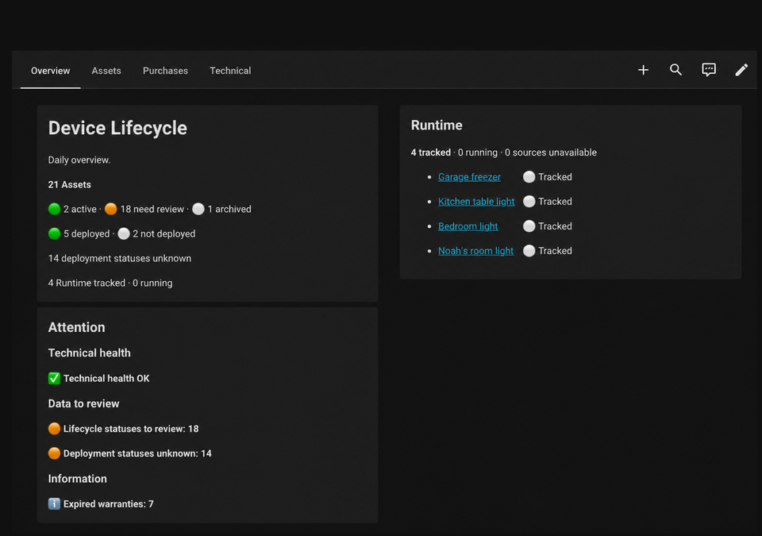
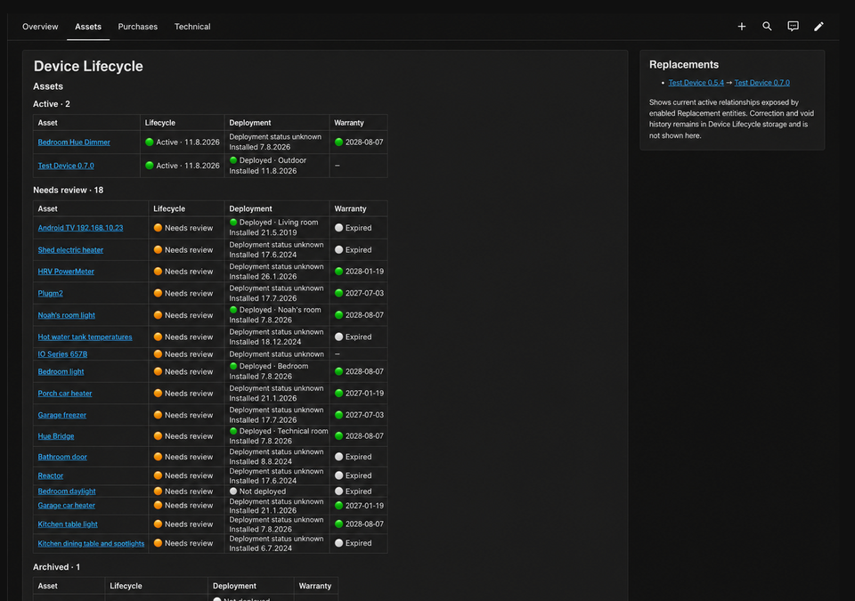
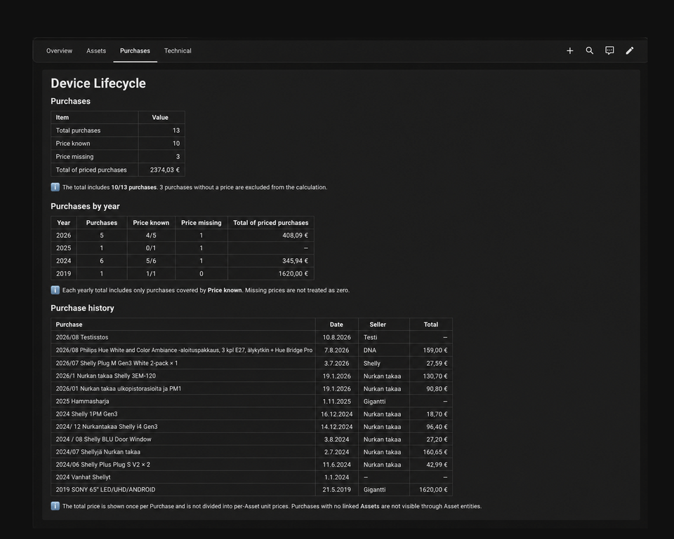
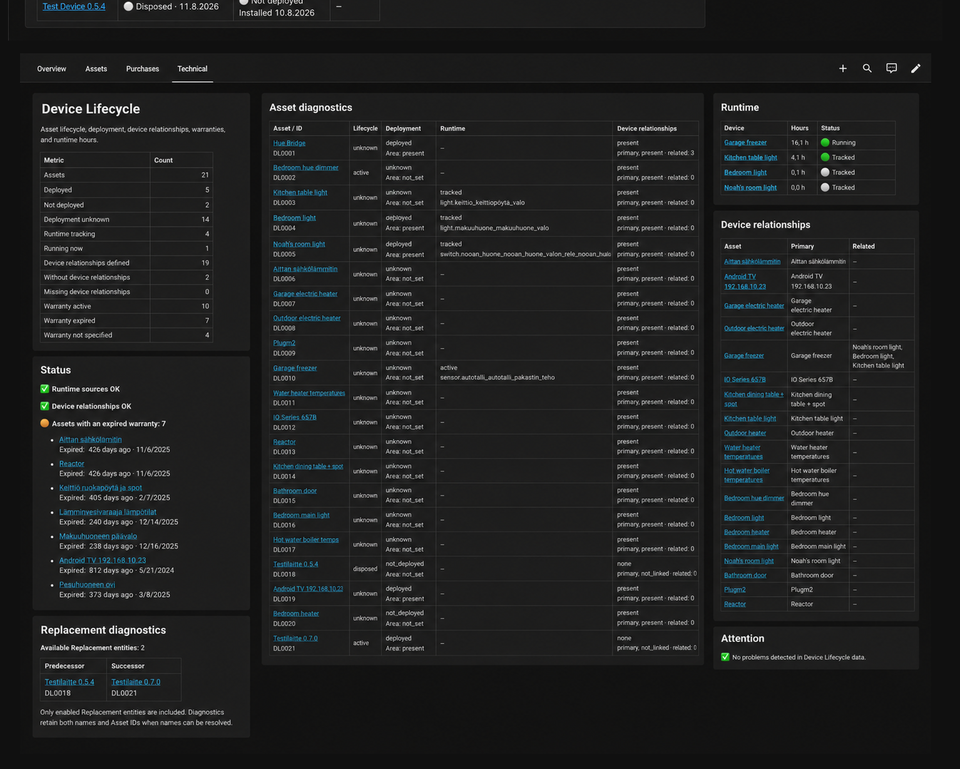

# Device Lifecycle dashboard

The optional Device Lifecycle dashboard provides a practical, native Home Assistant view of the integration's existing entities. It is a presentation layer only: the integration does not depend on it, and the dashboard does not write Asset Core data.

Ready-to-import versions are available in two languages:

- [`device-lifecycle-dashboard.en.yaml`](device-lifecycle-dashboard.en.yaml) — English
- [`device-lifecycle-dashboard.fi.yaml`](device-lifecycle-dashboard.fi.yaml) — Finnish

Both versions use the same logic and four-view structure. Only human-facing text differs:

| English | Finnish | Purpose |
| --- | --- | --- |
| Overview | Yleiskuva | Daily situation and attention items |
| Assets | Laitteet | Active, review, and archived Asset inventory plus replacements |
| Purchases | Ostot | Purchase-level counts, totals, and history |
| Technical | Tekninen | Dense Asset, Runtime, relationship, and replacement diagnostics |

## Use the dashboard

1. Install and configure Device Lifecycle, then allow its entities to load.
2. In Home Assistant, go to **Settings > Dashboards** and create an empty dashboard.
3. Open it, choose **Edit dashboard > Raw configuration editor**, and replace its contents with the English or Finnish ready-to-import YAML.
4. Save the dashboard.

The dashboard uses native Sections views and Markdown cards only. It discovers Device Lifecycle entities dynamically, so it does not require fixed entity IDs or custom cards. Replacement context appears only for enabled Replacement entities.

Canonical entity states and all comparisons remain English machine values such as `active`, `unknown`, `retired`, `disposed`, `lost`, `deployed`, and `not_deployed`. The two YAML files do not provide runtime language switching; choose the language-specific file you want to use.

Maintainers can regenerate both checked-in artifacts from the shared source and translations with:

```bash
python dashboard/build.py
python dashboard/build.py --check
```

## Screenshots

### Overview



### Assets



### Purchases



### Technical



The English images are crops of an actual Home Assistant dashboard capture from the completed dashboard work. Finnish screenshots are not yet available; no synthetic screenshots are included.
